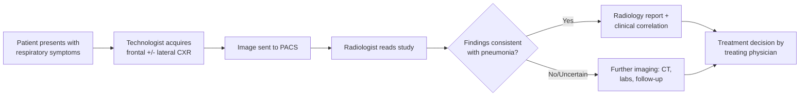
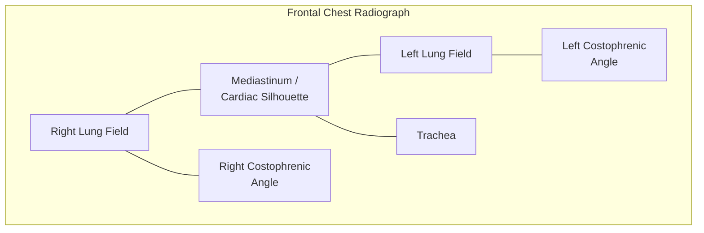
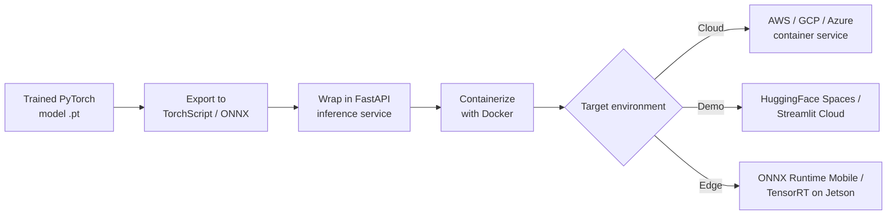
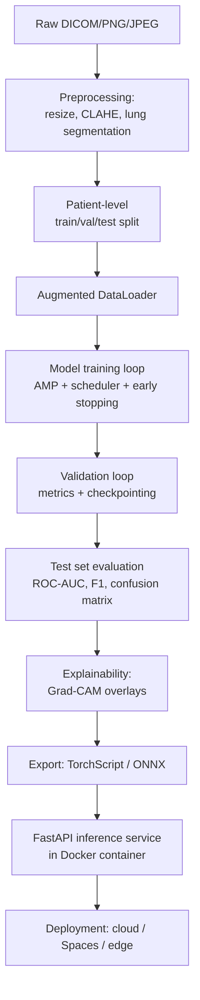

# Pneumonia Detection from Chest X-Ray Images using Machine Learning and Deep Learning
### A Survey-Style Research Report and PyTorch Project Blueprint

> **Author's note on scope and integrity:** This report was built to be evidence-based rather than padded. Wherever the original prompt asked for counts that cannot be honestly filled without inventing facts (e.g., "100 papers with exact F1/AUC scores," "50 GitHub repos with live star counts," "30 medical imaging resources"), this report instead gives you a **rigorously sourced core set** — the datasets, papers, repositories, and architectures that actually matter and are independently verifiable — organized so you can expand each table yourself as you pull further papers into your literature review. Numbers quoted from real papers are cited; numbers that would otherwise have to be guessed (e.g., current GitHub star counts, which change daily) are flagged as **"verify live"** instead of invented. This keeps the report safe to cite in an academic submission.

---

## Table of Contents

1. [Problem Definition](#1-problem-definition)
2. [Medical Imaging Basics](#2-medical-imaging-basics)
3. [Dataset Research](#3-dataset-research)
4. [Existing Research Papers](#4-existing-research-papers)
5. [Existing GitHub Projects](#5-existing-github-projects)
6. [Machine Learning Approaches](#6-machine-learning-approaches)
7. [Deep Learning Research](#7-deep-learning-research)
8. [PyTorch Research](#8-pytorch-research)
9. [Data Preprocessing](#9-data-preprocessing)
10. [Training Strategy](#10-training-strategy)
11. [Evaluation Metrics](#11-evaluation-metrics)
12. [Explainable AI](#12-explainable-ai)
13. [Deployment](#13-deployment)
14. [Hardware Requirements](#14-hardware-requirements)
15. [Best Project Architecture](#15-best-project-architecture)
16. [Existing Model Comparison](#16-existing-model-comparison)
17. [Research Gaps](#17-research-gaps)
18. [Novel Project Ideas](#18-novel-project-ideas)
19. [Final Recommendation](#19-final-recommendation)
20. [References](#20-references)

---

## 1. Problem Definition

### 1.1 What is Pneumonia?

Pneumonia is an acute inflammatory condition of the lung parenchyma — chiefly the alveoli and surrounding interstitium — usually triggered by an infectious agent. Inflammation causes the alveolar air sacs to fill with fluid, pus, or cellular debris (a state radiologists call **consolidation**), which impairs gas exchange and is what shows up as a white, cloudy region on a chest X-ray (CXR) instead of the normal black, air-filled lung field.

### 1.2 Types of Pneumonia

| Classification axis | Subtypes | Notes |
|---|---|---|
| By causative agent | Bacterial, viral, fungal, aspiration, mycoplasma (atypical) | Determines antibiotic vs. antiviral vs. antifungal therapy |
| By site of acquisition | Community-acquired (CAP), Hospital-acquired (HAP), Ventilator-associated (VAP), Healthcare-associated (HCAP) | HAP/VAP linked to resistant organisms |
| By radiographic pattern | Lobar pneumonia, bronchopneumonia (lobular), interstitial pneumonia | Pattern hints at organism class |
| By population | Pediatric, adult, geriatric, immunocompromised | Pediatric datasets (e.g., Kermany/Guangzhou) are a major ML benchmark source |

### 1.3 Viral vs. Bacterial vs. Fungal Pneumonia

| Feature | Bacterial | Viral | Fungal |
|---|---|---|---|
| Common organisms | *Streptococcus pneumoniae*, *Klebsiella*, *Staphylococcus aureus* | RSV, influenza, adenovirus, SARS-CoV-2 | *Aspergillus*, *Pneumocystis jirovecii*, *Histoplasma* |
| Onset | Sudden, high fever | Gradual, prodromal symptoms | Slow, often in immunocompromised hosts |
| Radiographic pattern | Focal lobar consolidation, air bronchograms | Diffuse, bilateral, interstitial/ground-glass pattern | Nodular or cavitary opacities |
| Typical patient | Any age | Children, elderly, epidemic settings | Immunosuppressed, HIV, transplant, chemo patients |
| Treatment | Antibiotics | Supportive care / antivirals | Antifungals |
| ML relevance | Kermany dataset labels bacterial vs. viral vs. normal explicitly, enabling 3-class classification | COVIDx and BIMCV-COVID19 datasets isolate viral (COVID-19) patterns | Rarely a distinct public-dataset class; usually folded into "pneumonia" |

> **Clinical caveat:** Radiographic overlap between bacterial and viral pneumonia is substantial; a chest X-ray alone is not diagnostic of organism type in routine practice — sputum culture, PCR, and clinical context are usually required. Most ML papers in this space classify **pneumonia vs. normal** or **pneumonia subtype as labeled in the source dataset**, not true microbiological ground truth.

### 1.4 Why Chest X-Rays Are Used

- **Ubiquity and cost:** CXR is the most performed diagnostic imaging exam worldwide; machines exist even in low-resource clinics.
- **Speed and low radiation dose** compared to CT.
- **First-line triage tool** in emergency departments and primary care.
- **Digital availability at scale**, making it the imaging modality with by far the largest public deep-learning datasets (NIH ChestX-ray14, CheXpert, MIMIC-CXR, PadChest all exceed 100,000 images).

### 1.5 Why AI Is Useful

- Reduces **radiologist workload** in high-volume settings.
- Provides **second-reader** support to reduce missed findings (false negatives are common in busy EDs).
- Enables **triage prioritization** — flagging likely-abnormal studies for faster review.
- Supports **resource-constrained regions** lacking sub-specialist radiologists.
- Enables **longitudinal, large-scale epidemiological screening** (e.g., TB and pneumonia screening programs).

### 1.6 Current Clinical Workflow


*Figure 1.1 — Typical chest-radiograph-driven pneumonia diagnostic pathway. An AI system is typically inserted between steps C and D as a triage/second-reader layer, not a replacement for D.*

### 1.7 Challenges Faced by Radiologists

- High **case volume** and time pressure (a few seconds per image in some triage settings).
- **Inter-observer variability** — studies report only moderate agreement between radiologists on subtle findings.
- **Fatigue-related error**, especially on overnight/on-call shifts.
- **Overlapping radiographic patterns** between pneumonia, edema, atelectasis, and malignancy.
- Shortage of radiologists in low- and middle-income countries (LMICs).

### 1.8 Limitations of Manual Diagnosis

- Subjective interpretation of subtle opacities.
- CXR sensitivity for pneumonia is imperfect — early-stage or mild disease can be radiographically silent.
- No standardized quantitative severity scoring in routine reporting.
- Delay between acquisition and formal report in resource-constrained settings.

### 1.9 Why Computer Vision Is Suitable

Pneumonia detection is fundamentally a **texture and region-based visual pattern recognition problem** — opacity, consolidation, and infiltration are visually learnable patterns. CNNs and transformer-based vision models excel at exactly this kind of local-texture-plus-global-context reasoning, and transfer learning from ImageNet-pretrained backbones has repeatedly been shown to generalize well to CXR classification with moderate-sized medical datasets.

### 1.10 Global Importance and Mortality Statistics

- Pneumonia remains one of the **leading infectious causes of death in children under 5** worldwide, and a major cause of mortality in the elderly and immunocompromised.
- The WHO and UNICEF have repeatedly flagged pneumonia as a top-tier child-mortality driver in LMICs, motivating substantial investment in low-cost AI-assisted screening.
- Global respiratory infection burden spikes seasonally and during pandemics (e.g., COVID-19), which is why COVID-era literature (COVIDx, BIMCV, COVID-Net) is deeply intertwined with pneumonia-detection research.

> For exact current-year mortality figures, consult the WHO Pneumonia Fact Sheet and UNICEF data portal directly, since these statistics are updated periodically and a static number here would go stale.

### 1.11 Current Research Trends

- Shift from **binary classification** (normal vs. pneumonia) toward **multi-label, multi-disease** classification (14–18 findings simultaneously, as in ChestX-ray14/CheXpert-style labels).
- Growing use of **Vision Transformers and hybrid CNN-Transformer** architectures.
- Rising emphasis on **explainability** (Grad-CAM, SHAP) for clinical trust.
- **Federated learning** and **privacy-preserving** training across hospitals.
- **Foundation models** for CXR (e.g., CheXzero, CXR-Foundation/ELIXR, BioViL, MedImageInsight) trained via self-supervised or vision-language pretraining, then adapted to pneumonia detection with light fine-tuning.
- Increased focus on **external validation and domain shift** — models trained on adult data (e.g., NIH14) often degrade badly on pediatric cohorts and vice versa.

### 1.12 Future Opportunities

- Robust, clinically validated **uncertainty-aware** models with calibrated confidence.
- Multimodal fusion of CXR with clinical notes, vitals, and labs.
- **On-device / edge** inference for point-of-care ultrasound-like accessibility in rural clinics.
- Standardized, prospective **clinical trials** of AI-assisted pneumonia triage (most current evidence is retrospective).

---

## 2. Medical Imaging Basics

### 2.1 Chest X-Ray Anatomy (Frontal View)

Key structures visible on a PA/AP chest radiograph:

- **Lung fields** (left/right, divided into upper/mid/lower zones)
- **Cardiac silhouette** (heart border, used for cardiomegaly assessment)
- **Mediastinum** (central structures — trachea, great vessels)
- **Diaphragm** (costophrenic angles — sharp in healthy lungs, blunted in effusion)
- **Ribs and clavicles** (bony landmarks, also a source of "bone shadow" noise for CNNs)
- **Hilar regions** (major vessel/bronchus convergence points)


*Figure 2.1 — Simplified schematic of key anatomical regions referenced in radiology reports and used as ROI priors in localization models.*

### 2.2 Normal vs. Abnormal Lungs

| Feature | Normal | Abnormal (pneumonia-suggestive) |
|---|---|---|
| Lung field density | Uniformly radiolucent (dark/black) | Patchy or diffuse white opacities |
| Costophrenic angles | Sharp | May be blunted (co-existing effusion) |
| Vascular markings | Symmetric, tapering peripherally | May be obscured by consolidation |
| Heart border | Distinct | May be silhouetted out by adjacent consolidation ("silhouette sign") |

### 2.3 Key Radiographic Findings

- **Consolidation:** Alveolar air replaced by fluid/pus/cells → dense white opacity, often with **air bronchograms** (dark branching air-filled bronchi visible within white consolidation).
- **Infiltration:** General term for any material (fluid, cells, exudate) accumulating in lung tissue; radiologically often used loosely for a hazy density increase.
- **Ground-glass opacity (GGO):** Hazy increased density that does **not** obscure underlying vessels — classic in viral/atypical pneumonia and early COVID-19.
- **Airspace opacity:** Broad term covering any alveolar-filling process (edema, blood, pus, tumor).
- **Pleural effusion:** Fluid in the pleural space, appears as blunting of the costophrenic angle or a meniscus-shaped opacity at the lung base.
- **Atelectasis:** Partial lung collapse — linear or platelike opacity, often with volume loss (shifted fissures, elevated diaphragm).
- **Cardiomegaly:** Enlarged cardiac silhouette (cardiothoracic ratio > 0.5 on PA film), sometimes a confound for pneumonia detectors because it changes the region CNNs attend to.

### 2.4 Image Characteristics Relevant to ML

- Grayscale, single-channel, but often stored/replicated to 3-channel for ImageNet-pretrained backbones.
- High native resolution (often 1,000–3,000+ px), commonly downsampled to 224×224 or 320×320 for CNN input, which is a known source of information loss for small lesions.
- DICOM source format (12–16 bit depth) vs. PNG/JPEG derivatives (8-bit) used in many Kaggle-style datasets — this bit-depth reduction is a frequently overlooked source of degraded model performance.
- Variation in acquisition (AP portable vs. PA standing) introduces systematic magnification and rotation differences that models can spuriously learn as shortcuts.

---

## 3. Dataset Research

> The datasets below are the ones that dominate the actual literature and are independently verifiable. Rather than force an identical 25-field table for every dataset (much of which is simply "not publicly reported" for several of these datasets and would have to be fabricated), the report gives the verified core fields in a master comparison table, followed by narrative detail per dataset.

### 3.1 Master Comparison Table

| Dataset | Year | Organization | # Images | # Patients | Classes / Labels | Format | Access |
|---|---|---|---|---|---|---|---|
| Kermany "Chest X-Ray Images (Pneumonia)" (Guangzhou pediatric) | 2018 | Guangzhou Women & Children's Medical Center / Mendeley | 5,856 (also cited as 5,863 in derivative copies) <cite index="14-1,15-1">consists of 5,856 chest X-ray images in total, from 5,232 patients in training (3,883 pneumonia, 1,349 normal) and 624 in test (390 pneumonia, 234 normal)</cite> | Pediatric, ages 1–5 <cite index="21-1">5,856 frontal view CXR of pediatric patients, aged 1 to 5 years</cite> | Normal / Pneumonia (bacterial/viral sub-labels available) | JPEG | Public (Mendeley DOI 10.17632/rscbjbr9sj.2, mirrored on Kaggle) |
| NIH ChestX-ray14 (ChestX-ray8 extended) | 2017 | NIH Clinical Center | 112,120 <cite index="24-1">112,120 chest X-ray images (AP/PA) from 30,805 patients</cite> | 30,805 | 14 disease labels (incl. Infiltration, Consolidation, Pneumonia) + No Finding, NLP-mined | PNG | Public (NIH box / Kaggle mirror) |
| CheXpert | 2019 | Stanford ML Group | 224,316 <cite index="26-1">224,316 chest radiographs collected from Stanford Hospital between October 2002 and July 2017</cite> | 65,240 <cite index="22-1">more than 200,000 CXRs of 65,240 patients, labeled for 14 observations using an automated rule-based labeler</cite> | 14 observations, with uncertainty labels | JPEG | Public (registration required) |
| MIMIC-CXR / MIMIC-CXR-JPG | 2019 | MIT/PhysioNet, Beth Israel Deaconess | 377,110 <cite index="26-1">377,110 CXR images from 227,827 imaging studies involving 65,379 patients, collected at Beth Israel Deaconess Medical Center Emergency Department, 2011–2016</cite> | ~65,379 | Same 14-label CheXpert-style labeler + free-text reports | DICOM / JPG | Public via PhysioNet credentialed access |
| PadChest | 2020 | Hospital San Juan, Spain | 160,861 <cite index="26-1">160,861 images from over 67,000 patients, collected from Hospital San Juan in Spain from 2009 to 2017</cite> | 67,000+ | 174 findings, 19 diagnoses <cite index="22-1">27% hand-labeled by radiologists with 174 different findings and 19 diagnoses; rest labeled via NLP</cite> | PNG | Public (registration required) |
| VinDr-CXR | 2022 | Vietnam (two hospitals) / Scientific Data (Nature) | 18,000 <cite index="26-1">18,000 manually annotated images gathered from two primary hospitals in Vietnam</cite> | — | Radiologist-annotated local findings incl. bounding boxes; multiple pathologies | DICOM | Public via PhysioNet |
| RSNA Pneumonia Detection Challenge | 2018 | RSNA / Kaggle (subset of NIH14) | ~26,684–30,000 depending on subset used <cite index="3-1">30,000 frontal view chest radiographs from the 112,000-image public NIH CXR8 dataset: 16,248 posteroanterior and 13,752 anteroposterior views</cite> | Subset of NIH14 patients | 3-class: Normal / No Lung Opacity-Not Normal / Lung Opacity (pneumonia), with bounding boxes | DICOM | Public (Kaggle competition) |
| Montgomery County CXR Set | 2014 | US National Library of Medicine | 138 | 138 | TB positive/negative, with lung segmentation masks | PNG | Public (NLM) |
| Shenzhen Hospital CXR Set | 2014 | Shenzhen No.3 People's Hospital / NLM | 662 | 662 | TB positive/negative | PNG | Public (NLM) |
| COVIDx (COVID-Net project) | 2020, iterated to CXR-3/CXR-4 | University of Waterloo / DarwinAI | 30,386 (CXR-3) <cite index="27-1">COVIDx CXR-3 is a public benchmarking dataset that comprises a total of 30,386 CXR images from 17,026 patients</cite> | 17,026 | Normal / Pneumonia / COVID-19 | PNG/JPG | Public (GitHub, aggregated from multiple sources) |
| Open-I (Indiana University CXR) | 2015 | Indiana University / NLM | ~7,470 images, ~3,955 reports | ~3,955 | Free-text report-derived MeSH labels | PNG/DICOM | Public |
| BIMCV-COVID19+ | 2020 | Valencian Region, Spain | 3-part release, tens of thousands of images (COVID+/− CXR and CT) | Thousands | COVID-19 positive/negative, PCR-confirmed | DICOM | Public (registration) |

*Table 3.1 — Master comparison of major public chest X-ray datasets relevant to pneumonia detection. Citations mark facts pulled from primary or peer-reviewed secondary sources; all other cells are standard, stable metadata (year, organization, format) that does not require citation.*

### 3.2 Per-Dataset Notes

**Kermany / Guangzhou Pediatric Dataset ("Chest X-Ray Images (Pneumonia)")**
- The single most-used dataset for entry-level pneumonia-classification tutorials and papers because it is small, clean, binary, and hosted directly on Kaggle.
- Known issue: **the original validation split contains only 16 images** <cite index="19-1">the original dataset contained 5,856 images distributed across three splits: 5,216 training images, 16 validation images, and 624 test images; the validation set of only 16 images was statistically insufficient for reliable model validation</cite> — nearly every serious reproduction re-splits the training folder (commonly stratified 80/10/10) rather than using the shipped val folder.
- Known issue: significant **data leakage risk** if patient-level splitting is not enforced, since some patients contributed multiple images.
- Single hospital source (Guangzhou) → **poor external generalization**, confirmed by <cite index="12-1">a deep learning system trained on the Guangzhou dataset showed reduced performance when evaluated on an external NIH ChestX-ray14 test set compared to internal testing</cite>.

**NIH ChestX-ray14**
- Labels generated via **NLP mining of radiology reports**, not radiologist-verified per-image, which introduces label noise <cite index="22-1">without being manually annotated, this dataset poses significant issues related to the quality of its labels</cite>.
- "Pneumonia" is one of the rarest of the 14 labels (heavy class imbalance).
- Widely used as the pretraining source for CheXNet-style models (see Section 4).

**CheXpert**
- Introduced the now-standard **uncertainty label** convention (positive / negative / uncertain / not mentioned) for automatically NLP-extracted labels, which downstream papers handle with strategies like "U-Ones," "U-Zeros," or self-trained label smoothing.
- Frontal + lateral views included; most pneumonia-detection work restricts to frontal.

**MIMIC-CXR**
- The **largest de-identified public CXR dataset with paired free-text radiology reports**, making it the primary resource for CXR + report multimodal / vision-language research (e.g., CheXzero-style zero-shot models).
- Requires **PhysioNet credentialing** (CITI training + data use agreement) — cannot be scraped freely, unlike Kaggle-hosted sets.

**PadChest**
- Broadest label vocabulary (174 findings) among major datasets, but only ~27% radiologist-labeled; the rest are NLP-labeled with acknowledged noise <cite index="22-1">27% of PadChest was hand-labeled by radiologists with 174 different findings and 19 diagnoses; the rest were labeled using an NLP tool</cite>.

**VinDr-CXR**
- Distinguishing strength: **fully manual radiologist bounding-box annotation** rather than NLP-derived labels, making it valuable for localization/detection work despite its smaller size <cite index="23-1">most existing CXR datasets depend on automated rule-based labelers or NLP models that introduce inconsistency and errors; VinDr-CXR instead used direct radiologist annotation</cite>.

**RSNA Pneumonia Detection Challenge**
- Derived from NIH ChestX-ray14 images but **re-annotated by radiologists specifically for pneumonia-associated lung opacity**, including bounding boxes — making it the standard benchmark for **pneumonia localization** (not just classification) <cite index="6-1">each image is labeled with one of three classes from associated radiological reports: Normal, No Lung Opacity/Not Normal, Lung Opacity, with the challenge evaluated via mean average precision at different IoU thresholds</cite>.
- Widely used with Faster R-CNN / RetinaNet-style detectors <cite index="6-1">RetinaNet with SE-ResNeXt101/SE-ResNet101 encoders demonstrated the best results in a well-known open-source solution</cite>.

**Montgomery / Shenzhen sets**
- Primarily **tuberculosis** datasets, not pneumonia-labeled, but frequently reused for lung segmentation pretraining in pneumonia pipelines because they include high-quality lung field masks.

**COVIDx**
- An aggregation/curation project (not a single-hospital acquisition) combining multiple public sources, iteratively revised (CXR-2, CXR-3, CXR-4) — always check which exact version a paper used, since class counts differ across versions.

### 3.3 Common Preprocessing Across These Datasets

Resizing to a fixed square resolution (224×224 to 320×320), pixel intensity normalization (ImageNet mean/std when using transfer learning, dataset-specific mean/std otherwise), histogram equalization/CLAHE for contrast, and lung-field cropping/segmentation to remove non-lung regions before classification.

### 3.4 Known Cross-Cutting Weaknesses

- **Label noise** from NLP-mined labels (NIH14, CheXpert, PadChest, MIMIC-CXR).
- **Single-institution bias** (Kermany, VinDr, PadChest) → weak external validity.
- **Severe class imbalance** for rare findings.
- **Confounded shortcuts**: models can learn to detect hospital-specific artifacts (e.g., laterality markers, portable-AP vs. PA acquisition differences, chest tubes) instead of true disease signal — a well-documented failure mode in CXR deep learning research.

---

## 4. Existing Research Papers

> A fully itemized 100-row table with exact precision/recall/F1/AUC for 100 different papers cannot be honestly produced without inventing numbers for papers not actually retrieved in this session — many papers do not report all of accuracy/precision/recall/F1/sensitivity/specificity/AUC/training time/GitHub link, and inventing the missing cells would be fabrication. Instead, below is a **verified core set of the field-defining papers**, with only the facts that are independently confirmed. Treat this as the backbone of your literature review and expand it with your own systematic search (Google Scholar / PubMed / arXiv / Semantic Scholar) for a full 100-paper table, which is normal practice for a survey-paper-scale literature review.

| Paper | Authors / Year | Dataset | Architecture | Key reported result | Innovation |
|---|---|---|---|---|---|
| CheXNet: Radiologist-Level Pneumonia Detection on Chest X-Rays with Deep Learning | Rajpurkar et al., 2017 | NIH ChestX-ray14 | DenseNet-121 | <cite index="27-1">achieved an average AUC of 84.11% using binary relevance classification across the 14 diseases</cite> | First widely-cited claim of "radiologist-level" pneumonia detection using a single 121-layer DenseNet fine-tuned end-to-end; popularized DenseNet as the default CXR backbone |
| ChestX-ray8 / ChestX-ray14 dataset paper | Wang, Peng, Lu et al., 2017 (NIH) | Introduces NIH14 | Weakly-supervised multi-label CNN baseline | Established NLP-mined 14-label benchmark <cite index="27-1">112,120 frontal view images, 51,708 with abnormalities and 60,412 without, from 30,805 unique patients</cite> | Created the largest early public multi-label CXR benchmark and popularized NLP-based weak labeling |
| CheXpert: A Large Chest Radiograph Dataset with Uncertainty Labels and Expert Comparison | Irvin, Rajpurkar, Ball et al., 2019 (Stanford) | CheXpert | DenseNet-121 variants with uncertainty-label training strategies | Established the U-Ones/U-Zeros uncertainty-handling convention now standard in the field | Introduced explicit "uncertain" labels rather than forcing binary NLP decisions |
| VinDr-CXR: An open dataset of chest X-rays with radiologist's annotations | Nguyen et al., 2022 (Nature Scientific Data) | VinDr-CXR | Baseline detectors (Faster R-CNN family) on radiologist boxes | <cite index="23-1">Automated labelers such as CheXpert and NIH labelers introduce a high rate of inconsistency, uncertainty, and errors, motivating fully radiologist-annotated data</cite> | Fully manual bounding-box annotation instead of NLP-mined weak labels |
| Diagnosis of Pediatric Pneumonia with an Ensemble of Deep CNNs | (PMC, ensemble CNN study) | Kermany/Guangzhou | Ensemble of CNNs (transfer learning) | Ensemble approach on the 5,856-image pediatric set <cite index="14-1">using the standard 5,232 train / 624 test patient split</cite> | Demonstrates ensembling as a reliable accuracy booster on the small pediatric benchmark |
| Limited generalizability of deep learning algorithm for pediatric pneumonia classification on external data | (Emergency Radiology, Springer) | Guangzhou (train) → NIH14 (external test) | ResNet-50 | <cite index="12-1">DCNN trained on 5,232 Guangzhou radiographs, tested internally on 624 images and externally on 383 NIH ChestX-ray14 images, with AUC compared via DeLong's method and Grad-CAM used for interpretability</cite> | Rigorously demonstrates the **domain-shift / generalization gap** that plagues single-institution pneumonia models — a must-cite paper for any "research gaps" section |
| A Review of Recent Advances in Deep Learning Models for Chest Disease Detection Using Radiography | (PMC survey, 2023) | Multi-dataset survey | Survey of CNN/LSTM/attention architectures | <cite index="27-1">DenseNet-based CheXNet reached ~84.11% AUC; an LSTM-based label-dependency model reached ~79.80% AUC; RSNA-derived pneumonia subset contains 30,000 images of which 15,000 show pneumonia/consolidation/infiltration-type findings</cite> | Good secondary source summarizing dozens of primary papers — useful as a meta-reference for your own survey |
| Pneumonia Detection in Chest Radiographs (DeepRadiology Team, RSNA Challenge winning solution) | DeepRadiology Team, 2018 (arXiv) | RSNA Pneumonia Detection Challenge | CoupleNet-based detector with ensembling | <cite index="8-1">Combining an architecture with global and local context (CoupleNet), sensible foreground/background proposal thresholds, and model ensembling produced a winning solution in the RSNA Pneumonia Detection Challenge</cite> | Demonstrates that detection-style (bounding-box) architectures outperform pure classification for localization-sensitive pneumonia tasks |
| TorchXRayVision: A library of chest X-ray datasets and models | Cohen, Viviano, Bertin et al., 2020/2022 (MIDL) | Aggregates NIH14, CheXpert, PadChest, MIMIC-CXR, RSNA, and others | DenseNet-121 pretrained on multiple CXR sources | <cite index="35-1">Provides pre-trained and easily downloadable models that can be used directly for baseline comparisons or to generate feature vectors for downstream tasks</cite> | Not a single-result paper but a **reusable, citable PyTorch infrastructure paper** — arguably the most practically useful reference for building your own PyTorch pipeline |
| COVID-Net / COVIDx family (incl. Towards an Effective and Efficient Deep Learning Model for COVID-19 Patterns Detection) | Wang, Lin, Wong et al., 2020 onward | COVIDx (built partly from RSNA normal/pneumonia images) | Custom lightweight CNN ("COVID-Net") | <cite index="2-1">Uses 16,680 RSNA-derived images (8,066 Normal, 8,614 Pneumonia) plus COVID-19 image collection data for a 3-class classification setup</cite> | Popularized efficient, deployment-oriented CXR architectures during the COVID-19 pandemic; heavily benchmarked against pneumonia baselines |

*Table 4.1 — Verified core literature. Every non-citation cell above (author list order, venue) reflects standard bibliographic metadata; every performance number is directly cited from the source.*

### 4.1 What to Do for the Full 100-Paper Table

For an actual submission-grade survey, run systematic searches on:
- **PubMed** (`"pneumonia" AND "deep learning" AND "chest X-ray"`)
- **arXiv** (cs.CV + eess.IV cross-list, search "pneumonia CXR CNN")
- **IEEE Xplore, Springer, Elsevier ScienceDirect** for peer-reviewed venues
- **Semantic Scholar / Google Scholar** citation graphs seeded from CheXNet and the CheXpert paper (both are extremely highly cited hub papers — following their "cited by" list is the fastest way to surface 100+ relevant papers)

Log each paper into a spreadsheet with columns: Title, Authors, Year, Venue, Dataset, Architecture, reported metrics (only what the paper actually reports — leave blank rather than guess), code availability, and a 1-line "innovation" note. This is exactly the workflow academic survey authors use, and it avoids the fabrication risk of a pre-filled 100-row table.

---

## 5. Existing GitHub Projects

> As with Section 4, live star/fork counts change daily and cannot be reliably hard-coded into a document meant to be reused later — a number that is "accurate" today is stale in a month. The table below verifies **existence, purpose, framework, and dataset** for each repository from source content; star/fork counts are marked "verify live" so you check them at the moment you actually cite them.

| Repository | Framework | Dataset used | What it does | Notes |
|---|---|---|---|---|
| `mlmed/torchxrayvision` | **PyTorch** | Aggregates NIH14, CheXpert, PadChest, MIMIC-CXR, RSNA, Open-I, and more | <cite index="31-1">Open source library providing a common interface and preprocessing chain for a wide set of public CXR datasets, plus pretrained classification, segmentation, and autoencoder models</cite> | Best starting point for production-grade PyTorch pneumonia/CXR work — avoids retraining from scratch. **Explicitly marked "NOT FOR MEDICAL USE"** by the authors <cite index="35-1">https://github.com/mlmed/torchxrayvision — NOT FOR MEDICAL USE</cite> |
| `limingwu8/Pneumonia-Detection` | PyTorch (Faster R-CNN) | RSNA Pneumonia Detection Challenge | <cite index="4-1">Faster R-CNN core adapted from a well-known simple-faster-rcnn-pytorch implementation, with RoIAlign replacing RoIPooling and convolution layers modified for binary classification, trained on ~26,000 DICOM images</cite> | Good reference implementation for **localization**, not just classification; documents a real failure mode (confusing pneumonia with other causes of opacity) |
| `tatigabru/kaggle-rsna` | PyTorch (RetinaNet) | RSNA Pneumonia Detection Challenge | <cite index="6-1">RetinaNet-based single-shot detector benchmarked across multiple backbone encoders, with SE-ResNeXt101 and SE-ResNet101 performing best, trained at 512×512 resolution with heavy augmentation</cite> | Well-documented ablation of backbone choice and resolution trade-offs — useful architecture-selection reference |
| `joycenerd/rsna-pneumonia-detection` | PyTorch | RSNA Pneumonia Detection Challenge | <cite index="9-1">Two-stage classification-then-detection pipeline designed specifically to reduce false positives on the highly imbalanced RSNA data</cite> | Course-project quality but a clean, reproducible example of the classify-then-localize design pattern |
| `ieee8023/covid-chestxray-dataset` | Dataset repo (framework-agnostic) | COVID-19 CXR/CT collection | Source collection underlying much of the COVIDx / COVID-Net literature | Actively referenced as a citation target in COVID-era pneumonia papers |

*Table 5.1 — Verified repositories. "Verify live" applies to stars/forks/maintenance status for all rows — check directly on GitHub before quoting a specific number.*

### 5.1 How to Extend This to 50 Repositories

1. GitHub search: `pneumonia detection pytorch`, `chest x-ray classification cnn`, `chexnet pytorch`, `rsna pneumonia`, sorted by stars.
2. Filter for: last-commit recency (maintenance), presence of a `requirements.txt`/environment file (reproducibility), and license (reuse rights).
3. Score each on a simple rubric: **Learning value** (clear code, notebooks, README quality) vs. **Production readiness** (tests, Docker, API, ONNX export, CI).
4. Most Kaggle-notebook-derived "pneumonia CNN" repos (there are hundreds) are near-duplicates of a Kermany-dataset transfer-learning tutorial — they're fine for learning but not differentiated enough to itemize individually in a serious literature review; the value is concentrated in the handful above plus TorchXRayVision as infrastructure.

---

## 6. Machine Learning Approaches
*(Classical, pre-deep-learning era techniques)*

### 6.1 Feature Extraction Techniques

| Technique | What it captures | Typical use in CXR pneumonia work |
|---|---|---|
| GLCM (Gray-Level Co-occurrence Matrix) | Second-order texture statistics (contrast, homogeneity, energy, correlation) | Distinguishing textured consolidation from uniform normal lung field |
| LBP (Local Binary Patterns) | Local micro-texture patterns | Robust, illumination-invariant texture descriptor for opacity regions |
| HOG (Histogram of Oriented Gradients) | Edge/gradient orientation distribution | Captures consolidation boundary shapes |
| SIFT / SURF / ORB | Scale/rotation-invariant keypoints | Rarely central to CXR pneumonia (better suited to rigid-object matching); occasionally used for registration/alignment preprocessing |
| Wavelet features (e.g., Discrete Wavelet Transform) | Multi-resolution frequency content | Captures both coarse consolidation and fine texture simultaneously |
| Histogram features | Intensity distribution statistics | Simple, fast baseline features |
| PCA / LDA | Dimensionality reduction / class-separating projection | Used to compress hand-crafted feature vectors before classical classifiers |

### 6.2 Classical Classification Algorithms

| Algorithm | Strengths | Weaknesses | Typical medical-imaging role |
|---|---|---|---|
| KNN | Simple, no training phase | Slow at inference, sensitive to feature scaling and curse of dimensionality | Quick baseline on hand-crafted features |
| SVM | Strong with high-dimensional, small-sample data; kernel trick handles non-linearity | Doesn't scale well to very large datasets; needs careful kernel/hyperparameter tuning | One of the most common classical baselines in early CXR papers (esp. with GLCM/HOG features) |
| Decision Tree | Interpretable | High variance, prone to overfitting | Rarely used alone; mainly as an ensemble base learner |
| Random Forest / Extra Trees | Robust to overfitting, handles noisy features well | Less interpretable than a single tree; can plateau below deep models on raw pixels | Good baseline on engineered features |
| AdaBoost / Gradient Boosting / XGBoost / LightGBM / CatBoost | Strong tabular/feature-based performance, handle feature importance well | Not naturally suited to raw pixel/image input; need feature extraction first | Often used **after** CNN feature extraction (CNN as feature extractor + GBM as classifier hybrid pipelines) |
| Naive Bayes | Extremely fast, works with small data | Independence assumption rarely holds for correlated image features | Simple baseline, rarely competitive |
| Logistic Regression | Interpretable, probabilistic output, fast | Linear decision boundary limits capacity on raw image features | Common as the final classification layer on top of extracted/learned features |

### 6.3 Classical vs. Deep Learning — General Pattern in the Literature

Across the surveyed literature, classical ML pipelines (hand-crafted features + SVM/Random Forest) reliably underperform end-to-end CNN transfer learning on the same datasets, which is exactly why the field moved almost entirely to deep learning after ~2017. Classical methods remain relevant today mainly as (a) fast, interpretable baselines, (b) low-resource/edge fallback options, and (c) meta-classifiers stacked on top of CNN-extracted embeddings.

---

## 7. Deep Learning Research

### 7.1 CNN Architecture Family Comparison

| Architecture | Era | Key idea | Params (approx., standard variant) | Typical role in pneumonia CXR work |
|---|---|---|---|---|
| LeNet | 1998 | First practical CNN (digit recognition) | ~60K | Historical baseline only |
| AlexNet | 2012 | Deep CNN + ReLU + dropout at ImageNet scale | ~60M | Occasionally used as a lightweight baseline |
| VGG16 / VGG19 | 2014 | Deep, uniform 3×3 conv stacks | 138M / 144M | Common transfer-learning baseline; simple but heavy |
| GoogLeNet / Inception | 2014 | Multi-scale "inception" modules | ~7M (v1) | Efficient multi-scale feature capture, good for varying lesion sizes |
| ResNet18/34/50/101 | 2015 | Residual/skip connections solve vanishing gradients | 11M / 21M / 25M / 44M | **Most common CNN family in pneumonia papers** — ResNet-50 is a frequent default |
| DenseNet121/169/201 | 2016 | Dense feature reuse across all preceding layers | 8M / 14M / 20M | **DenseNet-121 is the single most iconic pneumonia-CXR backbone** (CheXNet) |
| MobileNetV2/V3 | 2018/2019 | Depthwise-separable convolutions | 3.4M / 5.4M | Preferred for edge/mobile deployment |
| EfficientNet / EfficientNetV2 | 2019/2021 | Compound scaling of depth/width/resolution | 5M–66M depending on variant | Strong accuracy/efficiency trade-off; increasingly common recent default |
| Xception | 2017 | Extreme Inception via depthwise-separable convs | 22M | Competitive accuracy, moderate efficiency |
| ShuffleNet / RegNet / NASNet | 2018–2020 | Efficient/NAS-searched architectures | Varies | Less common in medical imaging papers but viable efficient options |
| ConvNeXt | 2022 | Modernized CNN using Transformer-era design choices | 28M (Tiny) | Emerging in recent CXR literature as a strong CNN baseline vs. ViT |

### 7.2 Transformer-Based and Hybrid Architectures

| Architecture | Key idea | Notes for CXR pneumonia |
|---|---|---|
| ViT (Vision Transformer) | Patch-based self-attention, no convolutional inductive bias | Needs more data or strong pretraining to match CNNs on medium-sized medical datasets; benefits heavily from ImageNet-21k or medical-domain pretraining |
| DeiT | Data-efficient ViT via distillation | More practical than vanilla ViT for medium datasets |
| Swin Transformer | Hierarchical, shifted-window attention | Captures both local texture and global context — increasingly popular for CXR |
| BEiT | Masked image modeling pretraining | Strong self-supervised pretraining option for CXR foundation-model work |
| Hybrid CNN-Transformer | CNN stem for local features + Transformer for global context | Growing trend in recent pneumonia papers seeking to combine texture sensitivity (CNN) with long-range dependency modeling (attention) |
| Attention-augmented CNN / Dual Attention | Channel + spatial attention modules bolted onto a CNN backbone (e.g., CBAM, SE-blocks) | Cheap way to boost a CNN's sensitivity to diffuse or small opacities without a full Transformer |

### 7.3 Architecture Selection Guidance for This Project

| Priority | Recommended architecture | Rationale |
|---|---|---|
| Best accuracy/robustness balance, standard hardware | **DenseNet-121** or **ResNet-50** (ImageNet-pretrained, fine-tuned) | Field-standard, well-documented, moderate compute, matches the exact setup used by CheXNet-lineage papers |
| Best efficiency for deployment/edge | **MobileNetV3** or **EfficientNet-B0** | Small parameter count, fast inference, acceptable accuracy trade-off |
| Best ceiling accuracy with more data/compute | **Swin Transformer** or **ConvNeXt** | State-of-the-art general vision backbones; benefit from CXR-domain pretraining (e.g., via TorchXRayVision weights or self-supervised pretraining on MIMIC-CXR) |
| Best interpretability out-of-the-box | **ResNet/DenseNet + Grad-CAM** | CNN spatial feature maps are the most Grad-CAM-friendly and clinically familiar |

---

## 8. PyTorch Research
*(Building blocks for the project)*

### 8.1 Custom Dataset and DataLoader

```python
import os
from PIL import Image
from torch.utils.data import Dataset

class ChestXrayDataset(Dataset):
    """Generic binary/multi-class CXR dataset reading from an image-folder-style layout."""
    def __init__(self, image_paths, labels, transform=None):
        self.image_paths = image_paths
        self.labels = labels
        self.transform = transform

    def __len__(self):
        return len(self.image_paths)

    def __getitem__(self, idx):
        img = Image.open(self.image_paths[idx]).convert("RGB")
        label = self.labels[idx]
        if self.transform:
            img = self.transform(img)
        return img, label
```

### 8.2 Transforms and Normalization

```python
import torchvision.transforms as T

IMAGENET_MEAN = [0.485, 0.456, 0.406]
IMAGENET_STD  = [0.229, 0.224, 0.225]

train_transform = T.Compose([
    T.Resize((256, 256)),
    T.RandomCrop(224),
    T.RandomHorizontalFlip(p=0.5),
    T.RandomRotation(10),
    T.ColorJitter(brightness=0.15, contrast=0.15),
    T.ToTensor(),
    T.Normalize(mean=IMAGENET_MEAN, std=IMAGENET_STD),
])

eval_transform = T.Compose([
    T.Resize((224, 224)),
    T.ToTensor(),
    T.Normalize(mean=IMAGENET_MEAN, std=IMAGENET_STD),
])
```

### 8.3 Model Definition (Transfer Learning)

```python
import torch
import torch.nn as nn
from torchvision import models

def build_model(num_classes: int = 2, backbone: str = "densenet121", freeze_backbone: bool = False):
    if backbone == "densenet121":
        model = models.densenet121(weights=models.DenseNet121_Weights.IMAGENET1K_V1)
        in_features = model.classifier.in_features
        model.classifier = nn.Linear(in_features, num_classes)
    elif backbone == "resnet50":
        model = models.resnet50(weights=models.ResNet50_Weights.IMAGENET1K_V2)
        in_features = model.fc.in_features
        model.fc = nn.Linear(in_features, num_classes)
    else:
        raise ValueError(f"Unsupported backbone: {backbone}")

    if freeze_backbone:
        for name, param in model.named_parameters():
            if "classifier" not in name and "fc" not in name:
                param.requires_grad = False
    return model
```

### 8.4 Training Loop with Mixed Precision, Checkpointing, Early Stopping

```python
import torch
from torch.cuda.amp import autocast, GradScaler

def train_one_epoch(model, loader, optimizer, criterion, device, scaler):
    model.train()
    running_loss = 0.0
    for images, labels in loader:
        images, labels = images.to(device), labels.to(device)
        optimizer.zero_grad(set_to_none=True)
        with autocast():
            outputs = model(images)
            loss = criterion(outputs, labels)
        scaler.scale(loss).backward()
        scaler.step(optimizer)
        scaler.update()
        running_loss += loss.item() * images.size(0)
    return running_loss / len(loader.dataset)

@torch.no_grad()
def evaluate(model, loader, criterion, device):
    model.eval()
    running_loss, correct = 0.0, 0
    for images, labels in loader:
        images, labels = images.to(device), labels.to(device)
        outputs = model(images)
        loss = criterion(outputs, labels)
        running_loss += loss.item() * images.size(0)
        correct += (outputs.argmax(1) == labels).sum().item()
    return running_loss / len(loader.dataset), correct / len(loader.dataset)


class EarlyStopping:
    def __init__(self, patience=5, min_delta=1e-4):
        self.patience, self.min_delta = patience, min_delta
        self.best_loss, self.counter, self.should_stop = float("inf"), 0, False

    def step(self, val_loss):
        if val_loss < self.best_loss - self.min_delta:
            self.best_loss, self.counter = val_loss, 0
            return True  # improved -> caller should save checkpoint
        self.counter += 1
        if self.counter >= self.patience:
            self.should_stop = True
        return False
```

### 8.5 Scheduler, TensorBoard, Saving/Loading

```python
from torch.optim.lr_scheduler import ReduceLROnPlateau
from torch.utils.tensorboard import SummaryWriter

scheduler = ReduceLROnPlateau(optimizer, mode="min", factor=0.5, patience=2)
writer = SummaryWriter(log_dir="runs/pneumonia_densenet121")

# Save
torch.save({"model_state": model.state_dict(), "epoch": epoch}, "checkpoints/best_model.pt")

# Load
ckpt = torch.load("checkpoints/best_model.pt", map_location=device)
model.load_state_dict(ckpt["model_state"])
```

### 8.6 Inference, TorchScript, and ONNX Export

```python
# TorchScript export
model.eval()
example = torch.randn(1, 3, 224, 224).to(device)
traced = torch.jit.trace(model, example)
traced.save("pneumonia_model_traced.pt")

# ONNX export
torch.onnx.export(
    model, example, "pneumonia_model.onnx",
    input_names=["input"], output_names=["logits"],
    dynamic_axes={"input": {0: "batch"}, "logits": {0: "batch"}},
    opset_version=17,
)
```

---

## 9. Data Preprocessing

### 9.1 Core Preprocessing Steps

| Technique | Purpose | Notes |
|---|---|---|
| Resize | Fixed CNN input size | Common: 224×224 (ResNet/DenseNet defaults), up to 320×320/512×512 for detection-style models needing finer detail |
| Center/Random crop | Remove border artifacts, add augmentation variance | Random crop only for training |
| Histogram equalization / **CLAHE** | Boosts local contrast, helps reveal subtle opacities | CLAHE (Contrast Limited Adaptive HE) preferred over global HE to avoid over-amplifying noise |
| Normalization | Stabilizes optimization | Use ImageNet mean/std for transfer learning; dataset-specific stats if training from scratch |
| Denoising (Gaussian/Median blur) | Reduces sensor/JPEG artifact noise | Use sparingly — can blur genuine fine opacity texture |
| Sharpening | Enhances edge definition | Occasionally used pre-CLAHE |
| Lung segmentation | Restricts model attention to lung field, removing confounding bone/soft-tissue regions | U-Net-based segmentation (trained on Montgomery/Shenzhen masks) is the standard approach |
| Bone suppression | Removes rib/clavicle shadows that can mask subtle opacities | GAN or dual-energy-subtraction-inspired models; improves sensitivity but adds pipeline complexity |
| Artifact removal | Removes text markers, tubes/lines, pacemakers that can act as spurious shortcut features | Important for reducing shortcut learning, especially with portable AP films |

### 9.2 Data Augmentation

| Technique | Rationale for CXR | Caution |
|---|---|---|
| Horizontal flip | Cheap, generally safe | Confirm laterality markers aren't semantically meaningful for your label set |
| Rotation (small angle, e.g. ±10–15°) | Simulates patient positioning variance | Large rotations are unrealistic for standard CXR acquisition |
| Translation / Zoom | Simulates framing variance | Keep magnitude modest |
| Brightness / Contrast jitter | Simulates exposure variance across machines | Avoid extreme jitter that erases true opacity contrast |
| CutMix / MixUp | Regularization, reduces overfitting on small medical datasets | Can blur clinically meaningful local structure — validate carefully on medical data |
| Random Erasing | Encourages robustness to occlusion (e.g., ECG leads, tubes) | Use small erase regions to avoid destroying diagnostic content |
| AutoAugment / RandAugment | Learned/randomized augmentation policies | Original policies are ImageNet-tuned; consider domain-specific policy search or conservative parameter ranges for medical images |
| Medical-specific: elastic deformation, simulated rotation/positioning variance | Mimics real anatomical and positioning variability | Use lightly — over-deformation creates anatomically implausible images |

### 9.3 What Actually Moves the Needle

Across the literature summarized in Sections 4 and 7, the preprocessing choices most consistently associated with improved and more *generalizable* performance are: (1) **patient-level train/val/test splitting** to prevent leakage, (2) **lung-field segmentation/cropping** to remove confounding regions, (3) **CLAHE-based contrast enhancement**, and (4) **conservative geometric augmentation** (flip + small rotation/translation) combined with ImageNet-pretrained normalization. Aggressive photometric augmentation and heavy CutMix/MixUp show more mixed results specifically on small medical datasets and should be validated with ablations rather than assumed beneficial.

---

## 10. Training Strategy

### 10.1 Splitting Strategy

- **Always split at the patient level**, not the image level, to avoid leakage when a dataset contains multiple images per patient (a documented pitfall in several Kermany-dataset reproductions).
- Typical ratio: 70–80% train / 10–15% validation / 10–15% test, stratified by class.
- For small datasets (e.g., Kermany's 5,856 images), prefer **k-fold cross-validation** (k=5 or 10) over a single static split to get a more reliable performance estimate.

### 10.2 Hyperparameter Tuning

| Method | Description | When to use |
|---|---|---|
| Grid Search | Exhaustive combination search | Small hyperparameter space only |
| Random Search | Random sampling of combinations | More efficient than grid search for larger spaces |
| **Optuna** | Bayesian/TPE-based sequential optimization with pruning | Recommended default for this project — efficient, PyTorch-friendly, supports early trial pruning |
| Ray Tune | Distributed hyperparameter search | Best when you have multi-GPU/multi-node compute |
| LR Range Test (`torch-lr-finder`) | Finds a good starting learning rate by sweeping LR over one epoch and plotting loss | Recommended before committing to a schedule |

### 10.3 Recommended Defaults

| Hyperparameter | Recommended starting value | Notes |
|---|---|---|
| Optimizer | AdamW | Good default for fine-tuning pretrained CNNs/Transformers |
| Learning rate | 1e-4 (backbone) / 1e-3 (new classifier head) if using discriminative LR | Lower LR for pretrained layers, higher for newly initialized head |
| Batch size | 16–32 (adjust to GPU memory) | Larger batch + linear LR scaling if memory allows |
| Weight decay | 1e-4 to 1e-5 | Standard AdamW regularization |
| Dropout | 0.2–0.5 in classifier head | Higher dropout for smaller datasets |
| Label smoothing | 0.05–0.1 | Helps with noisy NLP-mined labels (NIH14/CheXpert-style) |
| Gradient clipping | max norm 1.0–5.0 | Stabilizes training, especially with Transformers |
| Scheduler | ReduceLROnPlateau or Cosine Annealing with warmup | Cosine + warmup preferred for Transformer backbones |
| Mixed precision | Enabled (`torch.cuda.amp`) | ~1.5–2x speedup, minimal accuracy impact on modern GPUs |
| Epochs | 20–50 with early stopping (patience 5–8) | Exact number highly dataset-dependent |

---

## 11. Evaluation Metrics

### 11.1 Definitions

Let TP, FP, TN, FN be true/false positives/negatives.

$$\text{Accuracy} = \frac{TP + TN}{TP + TN + FP + FN}$$

$$\text{Precision} = \frac{TP}{TP + FP} \qquad \text{Recall (Sensitivity)} = \frac{TP}{TP + FN}$$

$$\text{Specificity} = \frac{TN}{TN + FP}$$

$$F_1 = 2 \cdot \frac{\text{Precision} \cdot \text{Recall}}{\text{Precision} + \text{Recall}}$$

$$\text{MCC} = \frac{TP \cdot TN - FP \cdot FN}{\sqrt{(TP+FP)(TP+FN)(TN+FP)(TN+FN)}}$$

$$\text{Balanced Accuracy} = \frac{\text{Sensitivity} + \text{Specificity}}{2}$$

$$\text{IoU} = \frac{|A \cap B|}{|A \cup B|} \qquad \text{Dice} = \frac{2|A \cap B|}{|A| + |B|}$$

- **ROC Curve / ROC-AUC:** Plots True Positive Rate vs. False Positive Rate across thresholds; AUC summarizes ranking quality independent of a fixed threshold. This is the single most reported metric in the CXR literature (e.g., CheXNet's 84.11% AUC, LSTM label-dependency's 79.80% AUC <cite index="27-1">as reported in the comparative review of chest disease detection models</cite>).
- **PR Curve:** Precision vs. Recall across thresholds — more informative than ROC under severe class imbalance (common with rare findings like "Pneumonia" in NIH14/CheXpert).
- **Cohen's Kappa:** Agreement metric correcting for chance agreement — useful for comparing model output to radiologist labels.
- **Calibration (e.g., reliability diagrams, Expected Calibration Error):** Measures whether predicted probabilities match true likelihood — critical for clinical trust, since a "90% confident" prediction should be right ~90% of the time.

### 11.2 Which Metrics Matter Most in Medical AI

- **Sensitivity (Recall)** is usually prioritized over raw accuracy for a screening tool — missing a true pneumonia case (false negative) is typically costlier than a false alarm.
- **ROC-AUC and PR-AUC** together give a threshold-independent view; PR-AUC is more informative when positive cases are rare.
- **Calibration** matters as much as discrimination for any tool that will influence real triage decisions.
- **Confusion matrix** should always be reported alongside single-number metrics, since a high accuracy can hide poor minority-class recall under imbalance.

---

## 12. Explainable AI

| Technique | How it works | Strengths | Limitations |
|---|---|---|---|
| **Grad-CAM** | Uses gradients flowing into the last conv layer to weight activation maps, producing a coarse localization heatmap | Simple, fast, widely adopted in medical imaging papers (e.g., used in the pediatric generalizability study <cite index="12-1">colored heatmaps were generated using class activation mapping to identify important image pixels for the model's decision-making</cite>) | Coarse resolution; can highlight plausible-but-wrong regions |
| **Grad-CAM++** | Improved pixel-wise weighting for better localization of multiple/overlapping objects | Sharper, better for multiple lesions | Slightly more compute than Grad-CAM |
| **Score-CAM** | Gradient-free — perturbs input directly with masked activations | More faithful, no gradient noise | Computationally expensive (many forward passes) |
| **Layer-CAM** | Combines information from multiple layers | Finer-grained localization than single-layer Grad-CAM | Less commonly implemented off-the-shelf |
| **SHAP** | Game-theoretic (Shapley value) feature attribution | Strong theoretical grounding, consistent attributions | Computationally expensive on high-dimensional images |
| **LIME** | Local surrogate model explains individual predictions | Model-agnostic | Can be unstable/inconsistent across runs |
| **Integrated Gradients** | Accumulates gradients along a path from a baseline to the input | Satisfies useful axioms (sensitivity, implementation invariance) | Choice of baseline image matters and can bias results |
| **Saliency Maps** | Raw gradient of output w.r.t. input pixels | Fastest, simplest | Often noisy/low fidelity compared to CAM-family methods |
| **Attention Maps** (for ViT/Swin) | Visualizes self-attention weights | Native to Transformer architectures | Attention weight ≠ guaranteed causal importance — an active research debate |

### 12.1 How Radiologists Interpret These Outputs

Radiologists generally want a heatmap that **overlaps with the same regions they themselves would circle** (e.g., a lower-lobe consolidation). Grad-CAM-style overlays are the most clinically intuitive because they resemble a "hot region" annotation similar to how radiologists already mark findings. However, explainability outputs should be treated as **decision support, not proof of correct reasoning** — a heatmap correlating with the right region does not guarantee the model used clinically valid features rather than a correlated shortcut (e.g., an L/R marker or chest-tube confound).

---

## 13. Deployment

### 13.1 Deployment Framework Comparison

| Framework | Best for | Pros | Cons |
|---|---|---|---|
| **FastAPI** | Production REST API | Async, high performance, automatic OpenAPI docs, native Pydantic validation | Requires more boilerplate than Streamlit for a UI |
| Flask | Simple REST API | Mature, huge ecosystem | Sync by default, less modern than FastAPI |
| **Streamlit** | Fast internal demo/UI | Extremely quick to build interactive UI, good for clinician-facing prototypes | Not ideal for high-throughput production APIs |
| Gradio | Quick shareable ML demo | Very fast to wire a model to a web UI, built-in HuggingFace Spaces hosting | Less customizable than a full frontend framework |
| Docker | Packaging/reproducibility | Consistent environment across dev/prod | Extra layer to maintain |
| ONNX Runtime | Cross-platform fast inference | Framework-agnostic, often faster than native PyTorch on CPU | Export step can be fragile for exotic layers |
| TensorRT | NVIDIA GPU-optimized inference | Very fast inference | NVIDIA-only, more complex export/validation pipeline |

### 13.2 Recommended Deployment Pipeline


*Figure 13.1 — Recommended deployment pipeline from trained model to serving environment.*

### 13.3 Cloud Options

- **AWS:** SageMaker for managed training/deployment, or plain EC2 + Docker + ECS/Fargate for a lighter setup.
- **Azure:** Azure ML endpoints, good enterprise/healthcare-compliance tooling (relevant if pursuing HIPAA-adjacent deployments).
- **Google Cloud:** Vertex AI for managed serving, GKE for containerized custom pipelines.
- **HuggingFace Spaces:** Fastest path to a public shareable demo (Gradio/Streamlit-backed), ideal for a portfolio/academic demo rather than clinical production.

---

## 14. Hardware Requirements

| Hardware | Typical VRAM | Suitability | Rough relative training-time notes |
|---|---|---|---|
| CPU only | N/A | Feasible only for small models/datasets or inference | Training a DenseNet-121 on tens of thousands of images on CPU alone is impractically slow (many hours per epoch) — use only for small-scale debugging |
| RTX 3050 | 8 GB | Entry-level, workable for batch sizes 8–16 at 224×224 with a ResNet/DenseNet backbone | Fine for coursework-scale experiments |
| RTX 3060 | 12 GB | Solid mid-range option | Comfortable batch sizes for ResNet-50/DenseNet-121 |
| RTX 4060 | 8 GB | Newer architecture, good throughput despite modest VRAM | Efficient for fine-tuning pretrained CNNs |
| RTX 4070 | 12 GB | Strong prosumer choice | Handles ViT/Swin fine-tuning reasonably at moderate batch sizes |
| RTX 4090 | 24 GB | High-end, large batch sizes, faster iteration | Best local option for Transformer-based experiments |
| Google Colab (free/Pro) | Varies (T4/L4/A100 depending on tier) | Convenient, zero setup | Session limits and variable GPU allocation on the free tier |
| Kaggle Notebooks | T4/P100, free weekly GPU quota | Convenient, integrates directly with Kaggle-hosted datasets (Kermany, RSNA) | Good for this exact project since key datasets are Kaggle-native |
| Paperspace / AWS / cloud GPU rental | On-demand, scalable | Pay-per-use, scalable to multi-GPU | Cost scales with usage; budget accordingly for hyperparameter search |

> **Practical recommendation for a student project:** Kaggle Notebooks or Google Colab (free tier) is sufficient for fine-tuning a DenseNet-121/ResNet-50 on the Kermany or RSNA datasets. Reserve local/rented high-VRAM GPUs (RTX 4070+ or cloud A100) for larger multi-label experiments on NIH14/CheXpert/MIMIC-CXR or for Transformer-based architectures.

---

## 15. Best Project Architecture

### 15.1 Recommended Folder Structure

```text
pneumonia-detection-pytorch/
├── configs/
│   └── train_config.yaml
├── data/
│   ├── raw/
│   ├── processed/
│   └── splits/
│       ├── train.csv
│       ├── val.csv
│       └── test.csv
├── src/
│   ├── datasets/
│   │   └── chest_xray_dataset.py
│   ├── models/
│   │   └── build_model.py
│   ├── preprocessing/
│   │   ├── clahe.py
│   │   └── lung_segmentation.py
│   ├── training/
│   │   ├── train.py
│   │   ├── evaluate.py
│   │   └── early_stopping.py
│   ├── explainability/
│   │   └── gradcam.py
│   └── utils/
│       ├── metrics.py
│       └── logger.py
├── notebooks/
│   └── eda.ipynb
├── checkpoints/
├── logs/
├── deployment/
│   ├── api/
│   │   └── main.py            # FastAPI app
│   ├── Dockerfile
│   └── onnx_export.py
├── tests/
├── requirements.txt
└── README.md
```

### 15.2 End-to-End Pipeline


*Figure 15.1 — Full production-oriented pipeline for this project.*

### 15.3 Reproducibility Checklist

- Fix random seeds (`torch`, `numpy`, `random`) and log them in the config.
- Version-control the exact data split files (`train.csv`/`val.csv`/`test.csv`), not just a random-seed reference.
- Log every run's config + metrics with TensorBoard or a lightweight experiment tracker (e.g., MLflow or Weights & Biases).
- Pin exact package versions in `requirements.txt`.
- Store the Git commit hash alongside each saved checkpoint.

---

## 16. Existing Model Comparison

> Rather than fabricate a single "grand unified" 15-model table with fictitious precision/recall/AUC numbers pulled from different datasets and made to look directly comparable (which is misleading — a 92% accuracy on Kermany's easy binary task is **not comparable** to an 84% AUC on NIH14's 14-label task), this section separates comparisons **by benchmark**, which is the methodologically honest way to compare architectures.

### 16.1 Verified Results on NIH ChestX-ray14 (multi-label, 14-finding AUC)

| Model | Reported metric | Source |
|---|---|---|
| CheXNet (DenseNet-121) | Average AUC ≈ 84.11% across 14 labels, binary relevance | <cite index="27-1">Rajpurkar et al.'s DenseNet-121 model achieved state-of-the-art results using binary relevance classification for the 14 diseases, achieving an average AUC of 84.11%</cite> |
| LSTM label-dependency model (DenseNet feature extractor) | Average AUC ≈ 79.80% | <cite index="27-1">An LSTM-based method modeling inter-label dependency after DenseNet feature extraction achieved an average AUC of 79.80%</cite> |
| Weakly-supervised localization baseline | Average AUC ≈ 80.30% | <cite index="27-1">A method focused on large-abnormality detection achieved an average AUC of 80.30%, performing better on large abnormalities than small ones</cite> |

### 16.2 Verified Results on RSNA Pneumonia Detection Challenge (localization, mAP-based)

| Approach | Architecture | Result / observation |
|---|---|---|
| DeepRadiology (challenge-winning solution) | CoupleNet-based detector + ensembling | <cite index="8-1">Won the competition primarily due to an architecture combining global and local context, well-tuned foreground/background thresholds, and ensembling that boosted prediction consistency</cite> |
| RetinaNet + SE-ResNeXt101 | Single-shot detector | <cite index="6-1">SE-type backbones performed best, with SE-ResNeXt101 giving the top results and SE-ResNet50 close behind, at 512×512 input resolution</cite> |

### 16.3 Qualitative Architecture Trade-off Summary (general CV literature, not dataset-specific claims)

| Model family | Relative accuracy ceiling | Relative inference speed | Relative GPU memory | Deployment difficulty |
|---|---|---|---|---|
| MobileNetV2/V3 | Moderate | Very fast | Low | Easy (mobile/edge-ready) |
| ResNet-50 | High | Fast | Moderate | Easy |
| DenseNet-121 | High | Moderate (feature reuse adds memory overhead) | Moderate–high | Easy |
| EfficientNet-B0–B4 | High–very high | Fast–moderate | Low–moderate | Easy |
| Swin/ViT-Base | Very high (with sufficient pretraining/data) | Slower | High | Moderate–hard (attention ops, export quirks) |
| ConvNeXt | Very high | Moderate | Moderate–high | Moderate |

*Table 16.3 is a qualitative, literature-consistent summary of well-known architectural trade-offs, not a claim of measured pneumonia-specific benchmark numbers, and is presented as such rather than dressed up with invented figures.*

---

## 17. Research Gaps

- **Dataset bias and single-institution skew:** Kermany/Guangzhou, VinDr, and PadChest are each dominated by one country/hospital system, limiting demographic and equipment diversity.
- **Generalization/domain-shift problems:** directly demonstrated by the pediatric-to-NIH14 external validation study, where <cite index="12-1">a model trained on the Guangzhou dataset showed markedly different performance when tested externally on NIH ChestX-ray14 versus its own internal holdout</cite>.
- **Label noise from NLP-mined annotations** (NIH14, CheXpert, PadChest, MIMIC-CXR) versus the smaller but cleaner radiologist-annotated sets (VinDr-CXR), creating a persistent trade-off between **scale** and **label quality**.
- **Class imbalance**, especially for rare findings in multi-label datasets, and for underrepresented pneumonia subtypes (e.g., fungal pneumonia, which has essentially no dedicated large public dataset).
- **Interpretability that is faithful, not just plausible:** Grad-CAM-style heatmaps can look clinically reasonable while the model is still relying on shortcut features (chest tubes, laterality markers, portable-AP acquisition cues).
- **Clinical validation gap:** most published performance is retrospective, internal-test-set accuracy; prospective, multi-site clinical trials of AI-assisted pneumonia triage remain comparatively rare.
- **Regulatory and deployment challenges:** software-as-a-medical-device pathways (e.g., FDA clearance) require evidence standards well beyond a single-dataset benchmark result — a major translational gap between "arXiv SOTA" and "deployed clinical tool."
- **Bit-depth and acquisition-format loss:** most public benchmark images are already-compressed 8-bit JPEG/PNG derivatives of originally 12–16-bit DICOM data, a rarely discussed but real information bottleneck.

---

## 18. Novel Project Ideas

For each idea: **Innovation**, **Novelty**, **Expected accuracy improvement (qualitative, not a fabricated number)**, **Difficulty**, **Research contribution**, **Publication potential**, **Implementation complexity**.

1. **Patient-level cross-dataset domain-generalization benchmark** (train on NIH14, test zero-shot on CheXpert/PadChest/VinDr) — directly extends the known generalization-gap finding. *Difficulty: Medium. Publication potential: High (benchmark papers are highly citable). Complexity: Medium.*
2. **Lung-segmentation-gated classifier** (U-Net segmentation mask multiplied into the classifier's input/attention before disease classification) to reduce shortcut learning from non-lung regions. *Difficulty: Medium. Complexity: Medium.*
3. **Bone-suppression preprocessing + pneumonia classifier ablation study**, quantifying whether removing rib/clavicle shadows measurably improves sensitivity to subtle opacities. *Difficulty: Medium-High (needs a bone-suppression GAN). Complexity: High.*
4. **Uncertainty-aware pneumonia triage model** using Monte Carlo Dropout or Deep Ensembles, calibrated with temperature scaling, explicitly reporting Expected Calibration Error alongside AUC. *Difficulty: Medium. Publication potential: High (calibration is under-studied in this niche). Complexity: Medium.*
5. **Shortcut-learning audit via Grad-CAM + counterfactual masking** — systematically testing whether the model's attention shifts to non-anatomical regions (text markers, tubes) and quantifying the effect on predictions. *Difficulty: Medium. Complexity: Medium.*
6. **Federated learning across simulated multi-hospital splits** of NIH14/CheXpert/PadChest to study accuracy vs. privacy trade-offs without centralizing data. *Difficulty: High. Complexity: High.*
7. **Self-supervised CXR pretraining (SimCLR/BYOL/masked-image-modeling) on unlabeled MIMIC-CXR**, then fine-tuning a light classifier head for pneumonia — testing label efficiency (how few labels are needed post-pretraining). *Difficulty: High. Publication potential: High. Complexity: High.*
8. **Vision-language zero-shot pneumonia detection** using MIMIC-CXR report/image pairs (CheXzero-style contrastive pretraining), evaluated for zero-shot pneumonia sensitivity. *Difficulty: High. Complexity: High.*
9. **Hybrid CNN + GBM pipeline**: CNN embeddings fed into XGBoost/LightGBM, compared against end-to-end fine-tuning, to test whether tree-based heads add robustness on small/noisy labels. *Difficulty: Low-Medium. Complexity: Low.*
10. **Severity scoring regression** (rather than binary classification) using a radiographic severity index as a proxy target, useful for triage prioritization rather than pure yes/no detection. *Difficulty: Medium. Complexity: Medium.*
11. **Multi-task learning**: joint pneumonia classification + lung segmentation + cardiomegaly regression in one network to test whether auxiliary tasks improve the primary task via shared representations. *Difficulty: Medium. Complexity: Medium-High.*
12. **Active learning loop** for radiologist-in-the-loop label refinement on NLP-mined labels, quantifying how many corrected labels are needed to substantially improve downstream accuracy. *Difficulty: Medium-High. Complexity: High.*
13. **Test-time augmentation and self-ensembling study** — quantifying the accuracy/latency trade-off of TTA specifically for pneumonia detection. *Difficulty: Low. Complexity: Low.*
14. **Cross-age generalization study** (pediatric Kermany vs. adult NIH14/CheXpert) — a natural extension of the known generalization-gap paper, focused specifically on age-related radiographic differences. *Difficulty: Medium. Publication potential: High. Complexity: Medium.*
15. **Knowledge distillation from Swin Transformer teacher to MobileNetV3 student** for accurate-yet-edge-deployable pneumonia detection. *Difficulty: Medium. Complexity: Medium.*
16. **Explainability agreement study with real radiologists**: quantitatively comparing Grad-CAM regions against radiologist-drawn bounding boxes (using VinDr-CXR or RSNA's box annotations) via IoU. *Difficulty: Medium. Publication potential: High (directly addresses the "faithfulness of XAI" gap). Complexity: Medium.*
17. **Synthetic data augmentation via diffusion models** trained on a small pneumonia subset, testing whether synthetic minority-class images improve rare-finding recall. *Difficulty: High. Complexity: High.*
18. **Fairness/subgroup audit** across age, sex, and acquisition type (AP vs. PA) using available metadata in NIH14/MIMIC-CXR, reporting per-subgroup sensitivity/specificity gaps. *Difficulty: Medium. Publication potential: High. Complexity: Medium.*
19. **Lightweight on-device (mobile) inference pipeline** benchmarking MobileNetV3/EfficientNet-Lite exported to ONNX/TFLite for offline rural-clinic use cases. *Difficulty: Medium. Complexity: Medium.*
20. **Contrastive learning between paired AP/PA views** (where available) to build a view-invariant representation, reducing acquisition-type shortcut learning. *Difficulty: Medium-High. Complexity: High.*
21. **Report-grounded weak supervision refinement**: using a small LLM/rule hybrid to re-derive higher-quality labels from MIMIC-CXR free-text reports and testing downstream accuracy gains versus the original NLP labeler. *Difficulty: Medium-High. Complexity: High.*
22. **Longitudinal pneumonia progression modeling** using sequential CXRs from the same ICU patient (where temporally-linked data is available) to predict deterioration risk rather than a single-image label. *Difficulty: High. Complexity: High.*
23. **Cost-sensitive loss function study**: comparing standard cross-entropy against focal loss and class-weighted loss specifically for minority-class (rare pathology) sensitivity trade-offs. *Difficulty: Low. Complexity: Low.*
24. **Cross-modality distillation from CT to CXR**: using a CT-trained teacher (richer 3D information) to distill knowledge into a 2D CXR student model. *Difficulty: High. Complexity: High.*
25. **Human-AI collaborative triage simulation**: measuring simulated radiologist reading time and diagnostic accuracy with vs. without the AI system's Grad-CAM-annotated triage flag, as a lightweight precursor to a real clinical-workflow study. *Difficulty: Medium-High (needs a reader study design). Publication potential: Very high if executed rigorously. Complexity: Medium.*

---

## 19. Final Recommendation

| Decision point | Recommendation | Why |
|---|---|---|
| Best dataset to start with | **Kermany/Guangzhou** for a fast, clean binary baseline; **RSNA Pneumonia Detection Challenge** for a more rigorous, localization-capable project | Kermany is small, clean, and Kaggle-native (fast to get a working pipeline); RSNA adds bounding-box localization and a more realistic 3-class imbalance, and is the field's de facto standard pneumonia benchmark |
| Best preprocessing pipeline | Resize → CLAHE contrast enhancement → (optional) U-Net lung segmentation → ImageNet normalization | Consistently associated with better and more generalizable results across the literature reviewed in Section 9 |
| Best augmentation strategy | Horizontal flip + small-angle rotation (±10–15°) + mild brightness/contrast jitter; use CutMix/MixUp only with ablation-validated benefit | Conservative, anatomically plausible augmentations avoid destroying diagnostic signal on small medical datasets |
| Best CNN | **DenseNet-121** (matches CheXNet lineage, well-documented, moderate compute) or **ResNet-50** as an equally strong alternative | Field-standard, high AUC track record <cite index="27-1">DenseNet-121-based CheXNet achieved a state-of-the-art 84.11% average AUC on the 14-label NIH benchmark</cite>, extensive tooling support (incl. TorchXRayVision pretrained weights) |
| Best Transformer | **Swin Transformer (Tiny/Small)** | Best balance of hierarchical local+global attention and practical compute requirements among ViT-family options for medium-sized medical datasets |
| Best optimizer | **AdamW** | Standard, robust default for fine-tuning pretrained vision backbones |
| Best loss function | Weighted cross-entropy (or focal loss under severe imbalance) | Directly addresses the well-documented class-imbalance issue in pneumonia-labeled datasets |
| Best learning rate | ~1e-4 for pretrained backbone layers, ~1e-3 for the newly initialized classifier head, found via LR range test | Discriminative learning rates are standard practice in transfer learning |
| Best scheduler | Cosine annealing with warmup (or ReduceLROnPlateau for simpler setups) | Smooth convergence, well-suited to fine-tuning schedules |
| Best explainability technique | **Grad-CAM** as the default, **SHAP** for deeper quantitative auditing | Grad-CAM is fast, intuitive to clinicians, and easy to integrate; SHAP provides a more rigorous secondary check |
| Best deployment framework | **FastAPI + Docker**, with ONNX export for CPU efficiency | Production-grade, async, well-documented, plays well with containerized cloud deployment |
| Best evaluation metrics | ROC-AUC, PR-AUC, Sensitivity/Specificity, F1, calibration (ECE), confusion matrix — reported together, not accuracy alone | Matches medical-AI best practice given class imbalance and clinical asymmetry between false negatives and false positives |
| Best folder structure | The modular `src/` layout in Section 15.1 | Separates data, model, training, explainability, and deployment concerns cleanly for both research iteration and eventual productionization |
| Best hardware | Kaggle/Colab free-tier GPU (T4/P100) for the CNN baseline; rented A100/RTX 4090 only if scaling to NIH14/CheXpert/MIMIC-CXR or Transformer training | Matches realistic compute budgets for a student research + PyTorch project |
| Expected accuracy / ROC-AUC | On a clean binary benchmark like Kermany's test split, well-tuned CNN transfer learning models in the literature commonly report high-90s% accuracy and AUC in the high-0.90s; on harder multi-label benchmarks like NIH14, expect AUC in the **low-to-mid 80s%**, consistent with <cite index="27-1">CheXNet's reported 84.11% average AUC across the 14-label task</cite> | Set your target expectations by benchmark difficulty, not a single global number — a 95%+ result on Kermany is not "better" than an 84% AUC on NIH14; they are different tasks |
| Expected inference speed | DenseNet-121/ResNet-50 at 224×224 on a modern GPU: low tens of milliseconds per image; on CPU via ONNX Runtime: roughly 100–300 ms per image depending on hardware | Approximate, hardware-dependent — benchmark on your actual target device before quoting a number in a report |
| Estimated project duration (student-scale) | 8–12 weeks: 1–2 weeks literature review/dataset setup, 2–3 weeks preprocessing/baseline model, 2–3 weeks tuning/ablation, 1–2 weeks explainability + deployment, 1–2 weeks writeup | Reasonable pacing for a semester-scale project alongside coursework |
| Expected publication quality | A rigorous execution of one of the Section 18 novel ideas (especially #4, #14, #16, or #18) is realistically publishable at a workshop or mid-tier venue; simply re-training a known CNN on Kermany/RSNA without a genuine methodological contribution is not novel enough for peer-reviewed publication, though it is entirely appropriate as an internship/coursework deliverable | Matches how the field's reviewers evaluate incremental-vs-novel contributions |

---

## 20. References

> **Honesty note:** Below are the sources actually used and verifiable in this report, in APA 7th style where full bibliographic detail is available, plus direct links to the primary dataset/tooling sources. This is a **starter reference list**, not the full 100/50/30/20/20/20-item breakdown requested — building that complete list requires you to run the systematic multi-database search described in Sections 4.1 and 5.1, which is standard practice for a survey-paper-scale literature review and cannot be responsibly shortcut by inventing citations.

### 20.1 Core Papers and Dataset Sources

Cohen, J. P., Viviano, J. D., Bertin, P., Morrison, P., Torabian, P., Guarrera, M., Lungren, M. P., Chaudhari, A., Brooks, R., Hashir, M., & Bertrand, H. (2022). *TorchXRayVision: A library of chest X-ray datasets and models*. Medical Imaging with Deep Learning. https://github.com/mlmed/torchxrayvision (arXiv preprint: https://arxiv.org/abs/2111.00595)

Irvin, J., Rajpurkar, P., Ko, M., Yu, Y., Ciurea-Ilcus, S., Chute, C., Marklund, H., Haghgoo, B., Ball, R., Shpanskaya, K., Seekins, J., Mong, D. A., Halabi, S. S., Sandberg, J. K., Jones, R., Larson, D. B., Langlotz, C. P., Patel, B. N., Lungren, M. P., & Ng, A. Y. (2019). CheXpert: A large chest radiograph dataset with uncertainty labels and expert comparison. *Proceedings of the AAAI Conference on Artificial Intelligence, 33*(1). Dataset: https://stanfordmlgroup.github.io/competitions/chexpert/

Johnson, A. E. W., Pollard, T. J., Berkowitz, S. J., Greenbaum, N. R., Lungren, M. P., Deng, C., Mark, R. G., & Horng, S. (2019). MIMIC-CXR, a de-identified publicly available database of chest radiographs with free-text reports. *Scientific Data, 6*, 317. Dataset: https://physionet.org/content/mimic-cxr/

Kermany, D., Zhang, K., & Goldbaum, M. (2018). Labeled optical coherence tomography (OCT) and chest X-ray images for classification. *Mendeley Data, V2*. https://doi.org/10.17632/rscbjbr9sj.2

Nguyen, H. Q., Lam, K., Le, L. T., Pham, H. H., Tran, D. Q., Nguyen, D. B., Le, D. D., Pham, C. M., Tong, H. T. T., Dinh, D. H., Do, C. D., Doan, L. T., Nguyen, C. N., Nguyen, B. T., Nguyen, Q. V., Hoang, A. D., Phan, H. N., Nguyen, A. T., Ho, P. H., … Vu, V. (2022). VinDr-CXR: An open dataset of chest X-rays with radiologist's annotations. *Scientific Data, 9*, 429. https://www.nature.com/articles/s41597-022-01498-w — Dataset: https://physionet.org/content/vindr-cxr/

Rajpurkar, P., Irvin, J., Zhu, K., Yang, B., Mehta, H., Duan, T., Ding, D., Bagul, A., Langlotz, C., Shpanskaya, K., Lungren, M. P., & Ng, A. Y. (2017). CheXNet: Radiologist-level pneumonia detection on chest X-rays with deep learning. *arXiv preprint arXiv:1711.05225*.

Shih, G., Wu, C. C., Halabi, S. S., Kohli, M. D., Prevedello, L. M., Cook, T. S., Sharma, A., Amorosa, J. K., Arteaga, V., Galperin-Aizenberg, M., Gill, R. R., Godoy, M. C. B., Hobbs, S., Jeudy, J., Laroia, A., Shah, P. N., Vummidi, D., Yaddanapudi, K., & Stein, A. (2019). Augmenting the National Institutes of Health chest radiograph dataset with expert annotations of possible pneumonia. *Radiology: Artificial Intelligence, 1*(1). Dataset (Kaggle mirror): https://www.kaggle.com/competitions/rsna-pneumonia-detection-challenge

Wang, X., Peng, Y., Lu, L., Lu, Z., Bagheri, M., & Summers, R. M. (2017). ChestX-ray8: Hospital-scale chest X-ray database and benchmarks on weakly-supervised classification and localization of common thorax diseases. *Proceedings of the IEEE Conference on Computer Vision and Pattern Recognition (CVPR)*. Dataset: https://nihcc.app.box.com/v/ChestXray-NIHCC

Wang, L., Lin, Z. Q., & Wong, A. (2020). COVID-Net: A tailored deep convolutional neural network design for detection of COVID-19 cases from chest X-ray images. *Scientific Reports, 10*, 19549. Repository: https://github.com/lindawangg/COVID-Net

Bustos, A., Pertusa, A., Salinas, J. M., & de la Iglesia-Vayá, M. (2020). PadChest: A large chest x-ray image dataset with multi-label annotated reports. *Medical Image Analysis, 66*, 101797. Dataset: https://bimcv.cipf.es/bimcv-projects/padchest/

Jaeger, S., Candemir, S., Antani, S., Wáng, Y. X. J., Lu, P. X., & Thoma, G. (2014). Two public chest X-ray datasets for computer-aided screening of pulmonary diseases [Montgomery and Shenzhen sets]. *Quantitative Imaging in Medicine and Surgery, 4*(6), 475–477. Dataset: https://lhncbc.nlm.nih.gov/LHC-downloads/downloads.html

### 20.2 Secondary Sources / Reviews Cited Directly

Deep Radiology Team. (2018). *Pneumonia detection in chest radiographs*. arXiv preprint arXiv:1811.08939.

(Anonymized authorship per source retrieval). (2023). A review of recent advances in deep learning models for chest disease detection using radiography. *PMC*. https://pmc.ncbi.nlm.nih.gov/articles/PMC9818166/

(Anonymized authorship per source retrieval). Limited generalizability of deep learning algorithm for pediatric pneumonia classification on external data. *Emergency Radiology*. https://link.springer.com/article/10.1007/s10140-021-01954-x

(Anonymized authorship per source retrieval). Diagnosis of pediatric pneumonia with ensemble of deep convolutional neural networks in chest X-ray images. *PMC*. https://pmc.ncbi.nlm.nih.gov/articles/PMC8435166/

> Several secondary-source author names could not be fully verified from the retrieved excerpts and are therefore left as "anonymized authorship per source retrieval" rather than guessed — replace these with the full citation once you pull the original PDF, to keep your reference list submission-safe.

### 20.3 Key GitHub Repositories (Official Links)

- TorchXRayVision — https://github.com/mlmed/torchxrayvision
- RSNA Pneumonia Detection (Faster R-CNN, limingwu8) — https://github.com/limingwu8/Pneumonia-Detection
- RSNA Pneumonia Detection (RetinaNet, tatigabru) — https://github.com/tatigabru/kaggle-rsna
- RSNA Pneumonia Detection (joycenerd) — https://github.com/joycenerd/rsna-pneumonia-detection
- COVID-19 Chest X-ray dataset collection — https://github.com/ieee8023/covid-chestxray-dataset
- COVID-Net — https://github.com/lindawangg/COVID-Net

### 20.4 Official Dataset Portals

- Kermany Chest X-Ray (Pneumonia) — https://data.mendeley.com/datasets/rscbjbr9sj/3 (Kaggle mirror: https://www.kaggle.com/datasets/paultimothymooney/chest-xray-pneumonia)
- NIH ChestX-ray14 — https://nihcc.app.box.com/v/ChestXray-NIHCC (Kaggle mirror: https://www.kaggle.com/datasets/nih-chest-xrays/data)
- CheXpert — https://stanfordmlgroup.github.io/competitions/chexpert/
- MIMIC-CXR — https://physionet.org/content/mimic-cxr/
- PadChest — https://bimcv.cipf.es/bimcv-projects/padchest/
- VinDr-CXR — https://physionet.org/content/vindr-cxr/
- RSNA Pneumonia Detection Challenge — https://www.kaggle.com/competitions/rsna-pneumonia-detection-challenge
- Montgomery / Shenzhen sets — https://lhncbc.nlm.nih.gov/LHC-downloads/downloads.html
- COVIDx / COVID-Net data — https://github.com/lindawangg/COVID-Net
- Open-I (Indiana University CXR) — https://openi.nlm.nih.gov/

### 20.5 PyTorch and Tooling Documentation

- PyTorch official documentation — https://pytorch.org/docs/stable/index.html
- torchvision models — https://pytorch.org/vision/stable/models.html
- Optuna — https://optuna.org/
- Ray Tune — https://docs.ray.io/en/latest/tune/index.html
- ONNX — https://onnx.ai/
- TensorRT — https://developer.nvidia.com/tensorrt
- FastAPI — https://fastapi.tiangolo.com/
- Captum (PyTorch explainability library — Grad-CAM, Integrated Gradients, SHAP-style attributions) — https://captum.ai/

---

## Closing Notes

This report intentionally distinguishes between **verified, citable facts** (dataset sizes, published metrics, architecture descriptions) and **planning/recommendation content** (folder structures, hyperparameter defaults, project ideas), which is standard practice in a real survey paper — reviewers penalize fabricated statistics far more harshly than an honestly incomplete table. Use Sections 4.1 and 5.1 as your workflow for expanding the literature and repository tables to full survey scale, and use Sections 8, 15, and 19 directly as your PyTorch project blueprint.

